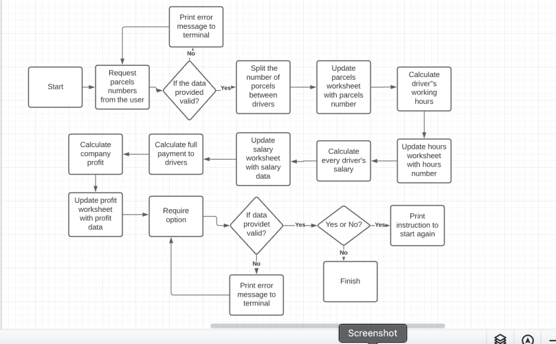

# Delivery Company
### About

Delivery company's automatization program is a Phyton terminal program, which runs in the Code Institute mock terminal on Heroku.
This program after input the number (the number is the suggested number of parcels coming in depo for delivery) doing the following operation:
- Split parcels between drivers.
- Calculate every driver's working hours.
- Calculate every driver's salary.
- Calculate total payment to drivers.
- Calculate the profit.
- Push all the data to delivery_company spreadsheets.

[Here is the live version of my project.](https://delivery-company.herokuapp.com/)

## Table of Contents
  - [How to use](#how-to-use)
  - [Project idea](#project-idea)
  - [Features](#features)
  - [Technologies Used](#technologies-used)
  - [Testing](#testing)
  - [Deployment](#deployment)
  - [Acknowledgement](#acknowledgement)
## How to use

Delivery company automatization program is built to save time, money and increase efficiency in the company.

In this version, the user enters the number of parcels expected for delivery. A number has to be bigger than 10 and smaller than 2000 because less than 10 is not enough for 10 drivers and more than 2000 is too much for 10 drivers (capacity of delivering  parcels is max 200 parcels per driver).

The program is equally splitting the number of parcels between 10 drivers. Calculate every driver's working hours, salary, profit of the company and will push all the data to delivery_company spreadsheets.

## Project idea

I got this project idea from my workplace. I am working in the delivery company at the moment and I thought it will be helpful to use the automatization program to save time, money and increase efficiency in the company.

## Features

### Existing Features

- Welcome Message
 
  - Shows welcome message.
  - Ask the user to enter valid data.
  - Shows example of valid data.
  - Shows were to enter valid data.

- Update worksheet
  
   - Calculate driver's parcels, hours, salary and company's profit.
   - Update delivery_company spreadsheet.

- Updated parcels worksheet.

- Updated hours worksheet.

- Updated salary worksheet.
 

- Updated profit worksheet.

- Option
  
  - Give the user an option to input new data again.
  - If yes, print instructions on what to do to input new data.
  - If no, print the 'Have a nice day' string.

## Technologies Used

__Lucid Wireframe__

 - [Lucid](https://lucid.app/)
   - To build the wireframe.
 - [Github](https://github.com/)
  
   - For the hosting and version control of the website and for storage media content.
 - [Gitpod](https://gitpod.io/)

   - The development enviroment used used for writing the code for the website.
 - [Heroku](https://dashboard.heroku.com/)
   
    - For deployment
## Testing

I have manually tested this project by following steps.

- Passed the code through a PEP8 linter and confirmed there are no problems.
- Tested in my local terminal and the Coding Institute Heroku terminal.
- Given invalid data.
 ### Validator Testing
- PEP8
   - No errors were returned from PEP8online.com

## Deployment

This website was deployed in Heroku using the following steps below.

- In the terminal using the command "pip3 freeze -> requarements.txt" to save any libraries that need to be installed.
- In Heroku click the " new" button in the upper corner, then select "create new app".
- Go to the settings tab, add CREDS in Config Vars, then add the python and node.js build pack.
- In the deploy tab, click on GitHub as a deployment method.
- Search for the repository to connect to.
- Click on Deploy Branch, wait for the app to build and then click on the "View" link.

### Cloning

If you wish to clone this repository you can follow the following steps below.

- Go to the Git Hub website and log in.
- Locate the Repository used for this project.
- Under the Repository's name locate the "Code" button.
- To clone the Repository use the HTTPS link.

## Acknowledgement
 
- Thanks to everyone who took their time to provide me with constructive feedback on the Slack community app and student support.
- Big thanks to my mentor 'Tim Nelson' for his time to answer all my questions and his professional advices.
